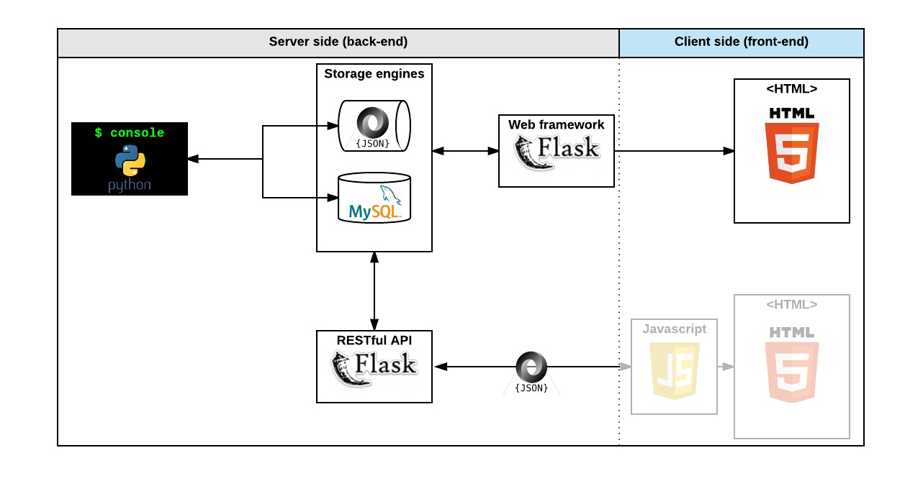

# 0x05. AirBnB clone - RESTful API

### Concepts
For this project, we expect you to look at these concepts:
- [REST API](https://intranet.alxswe.com/concepts/45)
- [AirBnB clone](https://intranet.alxswe.com/concepts/74)

# Resources
### Read or watch:

- REST API concept page
-[Learn REST: A RESTful Tutorial](https://www.restapitutorial.com/)
-[Designing a RESTful API with Python and Flask](https://blog.miguelgrinberg.com/post/designing-a-restful-api-with-python-and-flask)
-[HTTP access control (CORS)](https://developer.mozilla.org/en-US/docs/Web/HTTP/CORS)
-[Flask cheatsheet](chrome-extension://efaidnbmnnnibpcajpcglclefindmkaj/https://s3.amazonaws.com/intranet-projects-files/holbertonschool-higher-level_programming+/301/flask_cheatsheet.pdf)
-[What are Flask Blueprints, exactly?](https://stackoverflow.com/questions/24420857/what-are-flask-blueprints-exactly)
-[Flask](https://palletsprojects.com/p/flask/)
-[Modular Applications with Blueprints](https://flask.palletsprojects.com/en/1.1.x/blueprints/)
-[Flask tests](https://flask.palletsprojects.com/en/1.1.x/testing/)
-[Flask-CORS](https://flask-cors.readthedocs.io/en/latest/)

## General
- What REST means
- What API means
- What CORS means
- What is an API
- What is a REST API
- What are other type of APIs
- Which is the HTTP method to retrieve resource(s)
- Which is the HTTP method to create a resource
- Which is the HTTP method to update resource
- Which is the HTTP method to delete resource
- How to request REST API

# Requirements
## Python Scripts
- Allowed editors: vi, vim, emacs
- All your files will be interpreted/compiled on Ubuntu 20.04 LTS using python3 (version 3.4.3)
- All your files should end with a new line
- The first line of all your files should be exactly #!/usr/bin/python3
- A README.md file, at the root of the folder of the project, is mandatory
- Your code should use the PEP 8 style (version 1.7)
- All your files must be executable
- The length of your files will be tested using wc
- All your modules should have documentation (python3 -c 'print(__import__("my_module").__doc__)')
- All your classes should have documentation (python3 -c 'print(__import__("my_module").MyClass.__doc__)')
- All your functions (inside and outside a class) should have documentation (python3 -c 'print(__import__("my_module").my_function.__doc__)' and python3 -c 'print(__import__("my_module").MyClass.my_function.__doc__)')
- A documentation is not a simple word, it’s a real sentence explaining what’s the purpose of the module, class or method (the length of it will be verified)

## Python Unit Tests
- Allowed editors: vi, vim, emacs
- All your files should end with a new line
- All your test files should be inside a folder tests
- You have to use the [unittest module](https://docs.python.org/3.4/library/unittest.html#module-unittest)
- All your test files should be python files (extension: .py)
- All your test files and folders should start by test_
- Your file organization in the tests folder should be the same as your project: ex: for models/base_model.py, unit tests must be in: tests/test_models/- test_base_model.py
- All your tests should be executed by using this command: python3 -m unittest discover tests
- You can also test file by file by using this command: python3 -m unittest tests/test_models/test_base_model.py
- We strongly encourage you to work together on test cases, so that you don’t miss any edge cases

## GitHub
There should be one project repository per group. If you clone/fork/whatever a project repository with the same name before the second deadline, you risk a 0% score.

# More Info

## Install Flask
```
$ pip3 install Flask
```
Recreation of the AirBnB site, from the back-end data management to the front-end user interface. Written in Python and MySQL.

<h4>Third Phase</h4>
Developing an api to interface with the database.

<h4>Second phase</h4>
Command line interpretor can now save objects into a mysql database by setting the following environmental variables. Not setting these variables defaults to using a json file. Listed below are the values for the example database:

* MySQL user: ``HBNB_MYSQL_USER=hbnb_dev``
* MySQL password: ``HBNB_MYSQL_PWD=hbnb_dev_pwd``
* MySQL host: ``HBNB_MYSQL_HOST=localhost``
* MySQL database:  ``HBNB_MYSQL_DB=hbnb_dev_db``
* Storage type: ``HBNB_TYPE_STORAGE=db`` -- db is the only variable here. Any other option (including not set) will default to the storage type as a json object.


<h4>First phase</h4>
Where we are creating a command line interpretor to access objects that will store user data. Users can use the console to create objects, update object attributes, remove objects, list all objects, and store and read data from a .json file. 

## Install Dependencies 

<h6>1. Install MySql</h6>

1. ``MYSQL_APT=mysql-apt-config_0.8.3-1_all.deb``
2. ``wget https://dev.mysql.com/get/$MYSQL_APT``
3. ``sudo dpkg -i $MYSQL_APT``
4. ``sudo apt-get update``
5. ``sudo apt-get -y install mysql-server``

<h6>2. Install python3 modules</h6>

1. ``sudo apt-get -y install python3-pip``
2. ``sudo apt-get -y install python3-dev libmysqlclient-dev``
3. ``sudo -H pip3 install mysqlclient sqlalchemy Flask pep8``

<h6>3. (Optional) Fill the sql databases with example SQL data.</h6>
1. ``cat "100-dump.sql" | mysql -uroot -hlocalhost -p``
2. ``cat "10-dump.sql" | mysql -uroot -hlocalhost -p``
3. ``cat "7-states_list.sql" | mysql -uroot -hlocalhost -p``
4. ``cat "setup_mysql_dev.sql" | mysql -uroot -hlocalhost -p``
5. ``cat "setup_mysql_test.sql" | mysql -uroot -hlocalhost -p``

## Usage

### Types of interfaces

#### Through Python directly:

Example of Console Usage without a db:
```
~> python3
Python 3.4.3 (default, Nov 17 2016, 01:08:31) 
[GCC 4.8.4] on linux
Type "help", "copyright", "credits" or "license" for more information.
>>> import models
>>> s = models.State()
>>> s.name = "Calveticus"
>>> models.storage.new(s)
>>> models.storage.save()
>>> models.storage.count("State")
1
>>> exit()
~>
```

Example of Python usage directly with a db
```
~> HBNB_MYSQL_USER=hbnb_dev HBNB_MYSQL_PWD=hbnb_dev_pwd HBNB_MYSQL_HOST=localhost HBNB_MYSQL_DB=hbnb_dev_db HBNB_TYPE_STORAGE=db python3
Python 3.4.3 (default, Nov 17 2016, 01:08:31) 
[GCC 4.8.4] on linux
Type "help", "copyright", "credits" or "license" for more information.
>>> import models
>>> models.storage.count("State")
58
>>> exit()
~>
```

#### The Console
``console.py`` -- Command line interface to directly interact with databases, or object methods.
In order to begin the console, you can run either ``python3 console.py`` or ``./console.py`` in the command line.

The console currently supports the following commands:
* ``create <class name>``, which will create an object of the class declared by user;
* ``show <class name> <id>``, which will display the object information if it exists;
* ``destroy <class name> <id>``, which will delete the object if it exists;
* ``all <class name>``, where the class name input is optional and the console will display all instances, or all instances of a specified object;
* ``update <class name> <id> <attribute name> <attribute value>``, whilch will update an instance attribute of a previously declared object.

Additionally, the console also supports the following command formats:
* ``<class name>.all()``, which will display all instances of the specified class;
* ``<class name>.count()``, whilch will display the number of instances of the specified class;
* ``<class name>.show(<id>)``, whilch will display the instance with correct id and class;
* ``<class name>.destroy(<id>)``, which will delete the instance with correct id and class;
* ``<class name>.update(<id>, <attribute name>, <attribute value>)``, which will update an instance of the given class and id with the new attribute;
* ``<class name>.update(<id>, <dictionary representation>)``, which will update an instance of the given class and id with a dictionary of key value pairs that will be new attributes for the objects. 
* ``<class name>.create(<key>=<value>)`` create an instance of the class

Classes that are currently supported include BaseModel, User, City, State, Amenity, Review, and Place.


#### API Access
API -- interaction with the objects through HTTP GET requests


The following is an example of the process to lookup objects with GET requests and create a new place object with a POST request


```
(bash)~> curl -X GET http://0.0.0.0:5000/api/v1/states
[
  {
    "__class__": "State", 
    "created_at": "2017-03-25T19:44:42", 
    "id": "421a55f4-7d82-47d9-b54c-a76916479547", 
    "name": "California", 
    "updated_at": "2017-03-25T19:44:42"
  }, 
  {
    "__class__": "State", 
    "created_at": "2017-03-25T19:44:42", 
    "id": "421a55f4-7d82-47d9-b54c-a76916479552", 
    "name": "Illinois", 
    "updated_at": "2017-03-25T19:44:42"
  }
]
(bash)~> curl -X GET http://0.0.0.0:5000/api/v1/states/421a55f4-7d82-47d9-b54c-a76916479552/cities
[
  {
    "__class__": "City", 
    "created_at": "2017-03-25T19:44:42", 
    "id": "531a55f4-7d82-47d9-b54c-a76916479554", 
    "name": "Baton rouge", 
    "state_id": "421a55f4-7d82-47d9-b54c-a76916479554", 
    "updated_at": "2017-03-25T19:44:42"
  }, 
  {
    "__class__": "City", 
    "created_at": "2017-03-25T19:44:42", 
    "id": "541a55f4-7d82-47d9-b54c-a76916479554", 
    "name": "Lafayette", 
    "state_id": "421a55f4-7d82-47d9-b54c-a76916479554", 
    "updated_at": "2017-03-25T19:44:42"
  }
]
curl -X GET http://0.0.0.0:5000/api/v1/cities/531a55f4-7d82-47d9-b54c-a76916479554/
{
  "__class__": "City", 
  "created_at": "2017-03-25T19:44:42", 
  "id": "531a55f4-7d82-47d9-b54c-a76916479554", 
  "name": "Baton rouge", 
  "state_id": "421a55f4-7d82-47d9-b54c-a76916479554", 
  "updated_at": "2017-03-25T19:44:42"
}
curl -X GET http://0.0.0.0:5000/api/v1/users
[
  {
    "__class__": "User", 
    "created_at": "2017-04-27T13:08:49", 
    "email": "foo@eve.com", 
    "first_name": "Eve", 
    "id": "12cabb5b-dcdb-4b6a-8988-5153c3a61da0", 
    "last_name": null, 
    "password": "flowers", 
    "updated_at": "2017-04-27T13:08:49"
  }
]

curl -X POST http://0.0.0.0:5000/api/v1/cities/531a55f4-7d82-47d9-b54c-a76916479554/places -H "Content-Type: application/json" -d '{ "user_id": "12cabb5b-dcdb-4b6a-8988-5153c3a61da0", "name": "Somewhere_strange" }'
{
  "__class__": "Place", 
  "created_at": "2017-04-28T02:57:52.308374", 
  "id": "1b916f53-7f97-445e-a266-36466c889fb6", 
  "name": "Somewhere_strange", 
  "user_id": "1e8e8a2e-7bc7-41b4-80b5-7bc9e907dccd"
}

```

#### Front End Webserver
* Front end -- Website to display 


## Sample tests on the command-line
Check to see if the count method works with the ``test_get_count.py`` script.
```
HBNB_MYSQL_USER=hbnb_dev HBNB_MYSQL_PWD=hbnb_dev_pwd HBNB_MYSQL_HOST=localhost HBNB_MYSQL_DB=hbnb_dev_db HBNB_TYPE_STORAGE=db ./test_get_count.py
```

Simple preliminary tests to see if the Flask app runs.
```
HBNB_MYSQL_USER=hbnb_dev HBNB_MYSQL_PWD=hbnb_dev_pwd HBNB_MYSQL_HOST=localhost HBNB_MYSQL_DB=hbnb_dev_db HBNB_TYPE_STORAGE=db HBNB_API_HOST=0.0.0.0 HBNB_API_PORT=5000 python3 -m api.v1.app
```
### colaborators
- [Kenrique Ngwa](https://www.linkedin.com/in/awah-kenrique-anyere-ngwa-87118621a/)
- [Omar Aglan]()